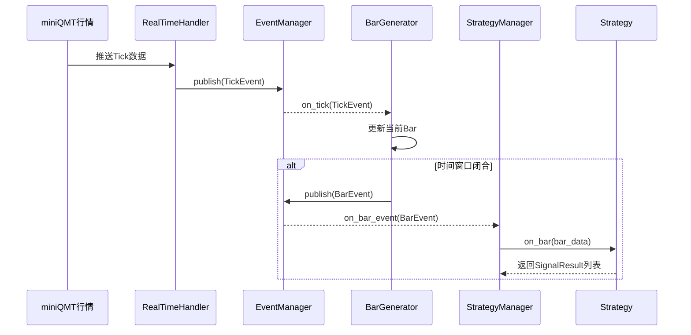
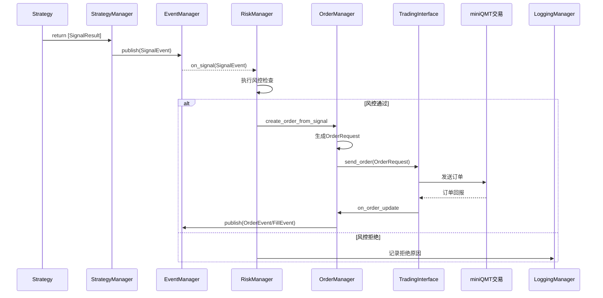

# 可转债交易策略平台 - 软件设计文档 (SDD)

**版本**: 1.0
**日期**: 2025-10-14

### **1. 概述**

#### 1.1. 文档目的
本文档为“可转债交易策略平台”项目提供详细的技术设计方案。它将PRD中的需求转化为具体的实现蓝图，定义了系统架构、模块职责、接口、数据模型和技术选型，作为软件开发、测试和后续维护的技术基准。

#### 1.2. 项目范围
本项目旨在构建一个集策略回测、实盘交易、风险控制和监控于一体的自动化交易系统。系统核心特点是策略插件化和事件驱动，初期专注于可转债的日内交易，并具备向其他资产类别扩展的能力。

### **2. 系统架构**

#### 2.1. 架构风格
本系统采用 **模块化的单体架构 (Modular Monolith)**。这种架构将系统划分为高内聚、低耦合的内部模块。

* **优点**:
    * 简化初期开发和部署的复杂性。
    * 模块间通过明确的接口进行通信，易于理解和维护。
    * 为未来演进为微服务架构奠定了坚实的基础，届时可将独立模块拆分为服务。
* **核心理念**: 系统在单一进程中运行，但代码层面严格遵循模块化边界。

#### 2.2. 高层架构图

```mermaid
graph TD
    subgraph User Interface
        WebApp[Web前端 (Vue.js / React)]
    end

    subgraph Backend Application (Python/FastAPI)
        APIServer[API服务 (FastAPI)]

        subgraph Core Engine
            EventManager[事件管理器 (Event Bus)]
            
            subgraph Data Manager
                DM[数据管理器]
                RealTimeHandler[实时数据处理器]
                BarGenerator[Bar生成器]
                DataDispatcher[数据分发器]
                HistoricalManager[历史数据管理器]
            end

            subgraph Strategy Manager
                SM[策略管理器]
                StrategyLoader[策略加载器]
                LifecycleManager[生命周期管理器]
            end

            subgraph Trading Engine
                TE[交易执行引擎]
                OrderManager[订单管理器]
                PositionManager[持仓管理器]
                RiskManager[风控管理器]
            end

            subgraph Backtesting Engine
                BE[回测引擎]
                DataReplayer[数据回放器]
                SimulationTrader[模拟交易器]
                ReportGenerator[报告生成器]
            end
        end

        subgraph System Services
            ConfigManager[配置管理器]
            LoggingManager[日志管理器]
            DBManager[数据库管理器]
        end

        subgraph External Interfaces
            QMT_Market[miniQMT行情接口]
            QMT_Trade[miniQMT交易接口]
        end
    end

    subgraph Database
        DB[(PostgreSQL)]
    end

    %% Connections
    WebApp -- HTTP/WebSocket --> APIServer
    APIServer -- Interacts with --> Core Engine
    APIServer -- Uses --> System Services

    Core Engine -- Pub/Sub --> EventManager

    DM -- Listens for TickEvent --> EventManager
    DM -- Publishes BarEvent --> EventManager
    SM -- Listens for BarEvent/TickEvent --> EventManager
    SM -- Publishes SignalEvent --> EventManager
    TE -- Listens for SignalEvent --> EventManager
    TE -- Publishes OrderStatusEvent --> EventManager
    BE -- Simulates Events --> EventManager

    RealTimeHandler -- Feeds Ticks --> DM
    TE -- Sends Orders --> QMT_Trade
    QMT_Market -- Pushes Data --> RealTimeHandler
    QMT_Trade -- Pushes Updates --> TE

    Core Engine -- CRUD --> DBManager
    DBManager -- Manages Connection --> DB
```

#### 2.3. 技术选型
* **后端语言**: Python 3.10+
* **Web框架**: FastAPI (提供高性能API和自动Swagger文档)
* **异步框架**: `asyncio` (用于处理高并发的I/O操作，如行情接收和API请求)
* **数据处理**: Pandas, NumPy
* **数据库**: PostgreSQL 14+
* **ORM**: SQLAlchemy 2.0 (提供强大的异步支持)
* **任务调度**: APScheduler (用于定时任务，如盘前加载、盘后结算)
* **前端框架**: Vue.js 3 (或 React)
* **部署**: Docker, Docker Compose

### **3. 模块详细设计**

#### 3.1. 事件管理器 (Event Manager / Event Bus)
* **职责**: 作为系统核心的解耦层，负责事件的注册、注销和分发。所有核心模块的交互都通过事件驱动。
* **核心逻辑**:
    * 维护一个事件类型到监听器（回调函数）列表的映射。
    * 提供 `subscribe(event_type, handler)` 和 `publish(event)` 方法。
    * 事件处理应为异步，以避免阻塞主事件循环。
* **关键事件类型**: `TickEvent`, `BarEvent`, `SignalEvent`, `OrderEvent`, `FillEvent`, `MarketOpenEvent`, `MarketCloseEvent`。
* **接口定义 (伪代码)**:
    ```python
    class Event:
        pass # Base class for all events

    class EventManager:
        def subscribe(self, event_type: str, handler: callable): ...
        async def publish(self, event: Event): ...
        def start(self): ...
        def stop(self): ...
    ```

#### 3.2. 数据管理器 (Data Manager)
* **职责**: 负责所有市场数据的获取、处理、合成和分发。
* **子模块**:
    * **实时数据处理器 (RealTimeHandler)**:
        * **逻辑**: 订阅miniQMT的行情接口，接收实时Tick数据。对数据进行清洗（如去重、处理异常值），然后封装成 `TickEvent` 并发布到事件总线。
        * **接口**: `connect()`, `disconnect()`, `on_qmt_tick(data)`.
    * **Bar生成器 (BarGenerator)**:
        * **逻辑**: 订阅 `TickEvent`。内部为每个标的维护一个临时的Bar数据结构。根据Tick数据实时更新当前Bar的`open`, `high`, `low`, `close`, `volume`。当达到Bar的时间周期（如30秒），将当前Bar封装成 `BarEvent` 发布到事件总线，并创建下一个新的Bar。
        * **配置**: Bar周期 (`bar_period`) 可由策略或全局配置定义。
    * **数据分发器 (DataDispatcher)**:
        * **逻辑**: 该功能由事件管理器和策略管理器的订阅机制共同完成，此处作为一个逻辑概念。
    * **历史数据管理器 (HistoricalManager)**:
        * **逻辑**: 提供查询历史行情数据的接口，供回测引擎和策略初始化时调用。数据来源为数据库。
        * **接口**: `async def get_historical_bars(stock_code, start, end, period) -> pd.DataFrame: ...`

#### 3.3. 策略管理器 (Strategy Manager)
* **职责**: 负责策略的加载、生命周期管理和调度。
* **子模块**:
    * **策略加载器 (StrategyLoader)**:
        * **逻辑**: 扫描 `strategies/` 目录，通过Python的 `importlib` 动态导入策略模块。读取 `config.json` 文件，并验证策略类是否完整实现了 `BaseStrategy` 的所有抽象方法。
        * **接口**: `scan_strategies() -> List[str]`, `load_strategy(name) -> BaseStrategy`.
    * **生命周期管理器 (LifecycleManager)**:
        * **逻辑**: 维护一个活动策略实例的字典。订阅 `BarEvent` 和 `TickEvent`，并将事件分发给所有订阅了该事件的活动策略实例（调用其 `on_bar` / `on_tick` 方法）。处理策略产生的 `SignalResult`，将其封装为 `SignalEvent` 并发布。
        * **接口**: `start_strategy(name, params)`, `stop_strategy(name)`, `reload_strategy(name)`.

#### 3.4. 交易执行引擎 (Trading Engine)
* **职责**: 接收交易信号，执行风控检查，管理订单和持仓。
* **子模块**:
    * **风控管理器 (Risk Manager)**:
        * **逻辑**: 作为订单发出的前置检查。订阅 `SignalEvent`。在订单生成前，执行所有风控规则：
            1.  **账户级**: 检查账户总回撤、当日亏损。
            2.  **仓位级**: 检查是否超过最大持仓数量、单只标的仓位上限。
            3.  **订单级**: 检查订单频率、资金是否充足。
        * 只有通过所有检查的信号，才会被转化为订单。
        * **接口**: `async def check_order(order_request) -> bool`.
    * **订单管理器 (OrderManager)**:
        * **逻辑**: 维护所有订单的状态机。
            * **状态**: `PENDING_SUBMIT` -> `SUBMITTED` -> `PARTIALLY_FILLED` -> `FILLED` / `CANCELLED`.
            * 订阅miniQMT的订单回报，更新订单状态，并发布 `OrderEvent` 和 `FillEvent`。
            * 实现PRD中定义的订单重试逻辑。
        * **接口**: `async def place_order(order_request)`, `async def cancel_order(order_id)`.
    * **持仓管理器 (PositionManager)**:
        * **逻辑**: 订阅 `FillEvent`，实时更新内部持仓信息（持仓数量、成本价、浮动盈亏）。为策略和风控模块提供实时的持仓查询。
        * **接口**: `get_position(stock_code)`, `get_all_positions()`.
    * **交易接口 (TradingInterface)**:
        * **逻辑**: 封装对miniQMT交易API的调用，处理连接、认证和协议细节。

#### 3.5. 回测引擎 (Backtesting Engine)
* **职责**: 离线模拟实盘环境，对策略进行历史数据回测和参数优化。
* **子模块**:
    * **数据回放器 (DataReplayer)**:
        * **逻辑**: 从历史数据管理器加载指定时间范围的数据。按时间戳顺序，模拟生成 `TickEvent` 或 `BarEvent` 并发布到事件总线。
    * **模拟交易器 (SimulationTrader)**:
        * **逻辑**: 模拟交易所的撮合行为。订阅 `SignalEvent`，根据下一根Bar的开盘价（或更复杂的撮合模型）模拟成交，并发布 `FillEvent`。模拟计算手续费和滑点。
    * **报告生成器 (ReportGenerator)**:
        * **逻辑**: 在回测过程中记录每一笔交易和每日的账户净值。回测结束后，根据这些数据计算PRD中定义的各项性能指标（夏普比率、最大回撤等），并生成可视化报告。

### **4. 数据库设计 (Schema)**

使用 `SQLAlchemy` 定义模型。

```python
# models.py
from sqlalchemy.orm import declarative_base
from sqlalchemy import Column, Integer, String, DateTime, Float, Date, Boolean, JSON

Base = declarative_base()

class HistoricalQuotes(Base):
    __tablename__ = 'historical_quotes'
    id = Column(Integer, primary_key=True, autoincrement=True)
    stock_code = Column(String(20), index=True)
    trade_date = Column(Date, index=True)
    trade_time = Column(DateTime, index=True)
    open_price = Column(Float)
    high_price = Column(Float)
    low_price = Column(Float)
    close_price = Column(Float)
    volume = Column(Integer)
    amount = Column(Float)

class CbInfoHistory(Base):
    __tablename__ = 'cb_info_history'
    stock_code = Column(String(20), primary_key=True)
    trade_date = Column(Date, primary_key=True)
    is_active = Column(Boolean)
    days_to_maturity = Column(Integer)
    conversion_premium = Column(Float)
    redemption_risk = Column(Boolean)
    delisting_risk = Column(Boolean)

class Trade(Base):
    __tablename__ = 'trades'
    id = Column(Integer, primary_key=True)
    strategy_name = Column(String(100), index=True)
    order_id = Column(String(100), unique=True)
    stock_code = Column(String(20), index=True)
    direction = Column(String(10)) # BUY/SELL
    filled_price = Column(Float)
    filled_quantity = Column(Integer)
    filled_time = Column(DateTime)
    commission = Column(Float)

class Order(Base):
    __tablename__ = 'orders'
    id = Column(Integer, primary_key=True)
    strategy_name = Column(String(100), index=True)
    order_id = Column(String(100), unique=True, index=True)
    stock_code = Column(String(20))
    direction = Column(String(10))
    order_type = Column(String(20)) # LIMIT/MARKET
    price = Column(Float)
    quantity = Column(Integer)
    status = Column(String(30))
    created_time = Column(DateTime)
    updated_time = Column(DateTime)
    
class DailyPnl(Base):
    __tablename__ = 'daily_pnl'
    id = Column(Integer, primary_key=True)
    trade_date = Column(Date, unique=True)
    net_value = Column(Float) # 净值
    pnl = Column(Float) # 当日盈亏
    drawdown = Column(Float) # 回撤

class BacktestReport(Base):
    __tablename__ = 'backtest_reports'
    id = Column(Integer, primary_key=True)
    strategy_name = Column(String(100))
    params = Column(JSON)
    start_date = Column(Date)
    end_date = Column(Date)
    report_data = Column(JSON) # 存储所有性能指标
    created_time = Column(DateTime)
```

### **5. 关键工作流 (Sequence Diagrams)**

#### 5.1. 实时Bar生成与策略响应



#### 5.2. 信号生成到订单执行



### **6. API接口设计 (RESTful)**

API服务 (FastAPI) 为前端UI提供数据和操作接口。

* **`GET /api/status`**: 获取系统核心模块的状态。
* **`GET /api/strategies`**: 列出所有可用的策略及其状态。
* **`POST /api/strategies/{strategy_name}/start`**: 启动指定策略。
* **`POST /api/strategies/{strategy_name}/stop`**: 停止指定策略。
* **`PUT /api/strategies/{strategy_name}/params`**: 热更新策略参数。
* **`GET /api/account/pnl`**: 获取账户实时的盈亏信息。
* **`GET /api/account/positions`**: 获取当前持仓。
* **`GET /api/orders`**: 获取当日订单列表。
* **`POST /api/backtest/run`**: 提交一个新的回测任务。
* **`GET /api/backtest/reports`**: 获取历史回测报告列表。

### **7. 非功能性需求实现**

* **可靠性**:
    * **状态持久化**: 交易引擎启动时，从数据库加载前一交易日的持仓信息。
    * **断线重连**: `TradingInterface` 和 `RealTimeHandler` 内实现带指数退避的自动重连机制。
* **性能**:
    * **异步优先**: 所有I/O密集型操作（网络、数据库）均使用 `async/await`。
    * **批量处理**: 数据库写入操作（如行情数据存储）采用批量插入，减少I/O次数。
* **安全性**:
    * **配置安全**: 敏感信息（账户、密码、API Key）通过环境变量或专用的 secrets management 工具注入，严禁硬编码。
    * **API认证**: 所有API端点通过JWT (JSON Web Tokens) 进行保护。
* **可维护性**:
    * **结构化日志**: 使用 `loguru` 或 Python 标准 `logging` 模块，输出JSON格式的日志，便于ELK等日志系统采集和分析。
    * **依赖管理**: 使用 `Poetry` 或 `pip-tools` 管理项目依赖，确保环境可复现。